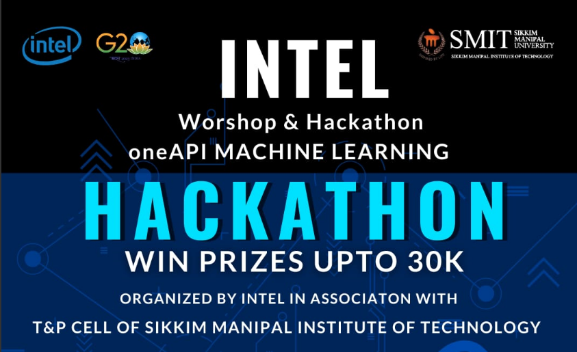

# Health Bridge - Team Techno Devs



## Tap the link below to check the Blog Post
## [Link to Blog Media for our ML project](https://medium.com/@deysampreet6/health-bridge-a-machine-learning-model-to-predict-diseases-ea336c8b62b9 )
## [Click here to view deployment](http://intel-health-bridge.onrender.com/)

## Project Overview

The goal of this project is to develop a machine learning algorithm that can accurately diagnose patients through telemedicine appointments using video input (or text as a fallback option). With the COVID-19 pandemic limiting in-person visits, telemedicine has become increasingly important for providing healthcare to patients. However, accurately diagnosing patients through telemedicine can be challenging due to the limitations of virtual visits. By developing a machine learning algorithm that can analyze patient data from video input and provide accurate diagnoses, we hope to improve patient outcomes and reduce the strain on healthcare systems.

## Data

We will be using a dataset of patients' symptoms that have been gathered from various sources. The data gathered from the sources will be used to train the model, and then we will use natural language processing (NLP) techniques to extract relevant information from the patient.

## Methods

We will first use Natural language Processing to extract the symptoms and then, will be predicting the disease using one of the machine learning algorithms - Logistic Regression, Decision Tree Classifier and Random Forest Classifier.

After throrough analysis of accuracy, we have chosen __Random Forest Classifier__ to train our model.

The process for predicting the disease is as follow: 

- User can enter their symptoms either through text or by uploading their video.
- If text is entered, the symptoms will be generated using __Natural Language Processing__ and matched with the dataset.
- If Video is uploaded, symptoms will be identified from that video using __NLP__ which then will be matched with the dataset.
- Now, the symptoms will be fed to the model, and the output will be predicted.
- The predicted output will be generated in the Streamlit server.

[Click here to see how we did it 😄](https://github.com/pooranjoyb/health-bridge/blob/master/health-bridge/models/train/model.ipynb)
## Results

We will evaluate our model's performance using various metrics such as accuracy, precision and confusion matrix. We will also perform cross-validation to ensure that our model is robust and can generalize to new data.

## Getting Started

To get started with this application, you will need to have the dependencies installed on your system. You can install the dependencies using pip:

### Installing Dependencies
```python
pip install -r requirements.txt
```
### Starting the Dev Server
Once you have installed the dependencies, you can run the application by executing the following command in the root directory 

```python
python -m health-bridge
```
__Uses Intels patched scikit learn (scikit-learn-intelex) for optimized performance__

## Conclusion

Through this project, we aim to develop a machine learning algorithm that can accurately diagnose patients through telemedicine appointments using video input. By improving the accuracy of virtual diagnoses, we hope to improve patient outcomes and reduce the strain on healthcare systems. The use of speech-to-text technology and NLP techniques to extract information from patient videos has the potential to revolutionize the way telemedicine appointments are conducted and improve the quality of care provided to patients. It also enables people with certain disabilities get diagnosed remotely without any help. Our goal during this project is to provide diagnosis of some common diseases remotely without any human supervision.

# Demonstration of the Project (With Text) : 

[demonstration.webm](https://user-images.githubusercontent.com/90945182/226211024-d5584ef1-5fe5-4b0d-a9b7-557efa7675e4.webm)

# Demonstration of the Project (With Video) :


https://user-images.githubusercontent.com/34091879/226434014-510fd1ee-4405-4fec-8a64-2f86d2434131.mp4


## 😍 Our Valuable Contributors

Thanks to these wonderful people ✨

<a href="https://github.com/pooranjoyb/health-bridge/graphs/contributors">
  
</a>

💙 Happy Contributions !! 💙


## 📝 Feedback

If you have any feedback, please reach out to us at  pooranjoy@gmail.com

## 📜 License 

Distributed under the MIT License. 
[MIT](LICENSE)
